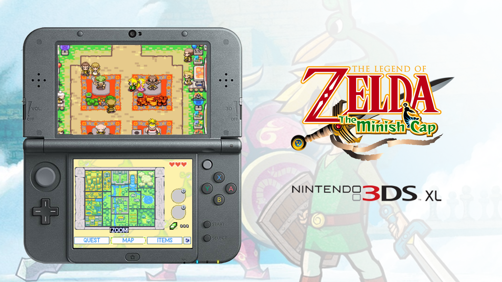

# The Minish Cap 3DS — Chinese Edition

A Nintendo 3DS dual-screen Chinese edition of *The Legend of Zelda: The Minish Cap*, with touch controls, live world and dungeon maps, Chinese interface text, display options, and handheld-focused tuning.

**Current release: 1.3-E21**

## Downloads

Download the installable CIA or Homebrew Launcher 3DSX from the [E21 release page](../../releases/tag/v1.3-E21).

- `tmc-3ds-cn-angel-sp4-v1.3-E21.cia`
- `tmc-3ds-v1.3-E21.3dsx`

This distribution does not contain a Game Boy Advance ROM. Players provide their own compatible USA or European `.gba` file.

## Chinese User Guide

The complete installation, first-launch audio, lower-screen, item assignment, map, quest, settings, diagnostics, and randomizer tutorial is available here:

- [E21 Chinese User Guide](docs/E21-USER-GUIDE-ZH.md)

## E21 Highlights

- Unified 12 px Chinese and Latin lower-screen font with white glyphs and black outlines.
- Corrected map enlarge/shrink actions and labels.
- Improved raised red UI title plates and spacing.
- Corrected area-name banners and L/R tutorial pictures.
- Fixed widescreen dialogue tearing.
- Stabilized the Deepwood Shrine rolling-barrel scene.
- Added validation around player-item dispatch to prevent the reported doorway crash.

See [CHANGELOG-E21.md](CHANGELOG-E21.md) for the complete update record.

## Installation Summary

1. Install the CIA with FBI, or launch the 3DSX through Homebrew Launcher.
2. Create `sdmc:/3ds/The Minish Cap 3DS/` on the SD card.
3. Place a compatible `.gba` file in that directory.
4. For first-launch audio, open Luma3DS Rosalina with **L + D-Pad Down + SELECT**, then select `Miscellaneous options > Dump DSP firmware` and restart the game.

## Distribution Repository

This public repository contains release information, documentation, artwork, license notices, and downloadable builds. Development files are maintained separately.

For corresponding-source inquiries, contact `chrt7n43ool@gmail.com`.

## Credits

This edition builds on Project Picori, the Minish Cap decompilation project, and related dual-screen port work. Copyright and license notices remain in [LICENSE](LICENSE) and [THIRD-PARTY-LICENSES.md](THIRD-PARTY-LICENSES.md).

Nintendo owns *The Legend of Zelda*, *The Minish Cap*, and all associated game content. This is an unofficial fan-made project and is not affiliated with or endorsed by Nintendo.
